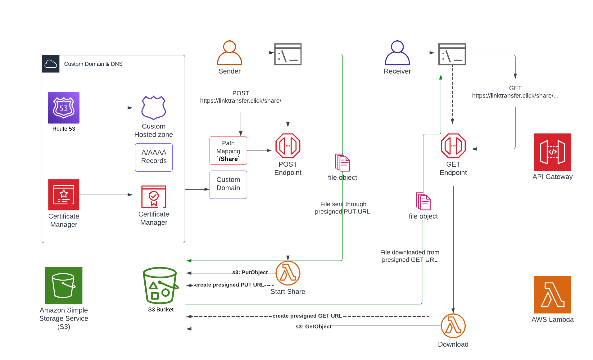

# Link Transfer
Link Transfer is a cloud-based file-sharing application built on top of AWS services. It is a secure and privacy-centered alternative to services like Wetransfer and Dropbox.

## Features
* Convenient upload and download through custom-built CLI interface
* Secure and scalable object storage through S3
* Streamlined service provision and deployment with Serverless Framework
* Accessed through a custom domain that connects to API Gateway

The architecture diagram of the application is shown below:
